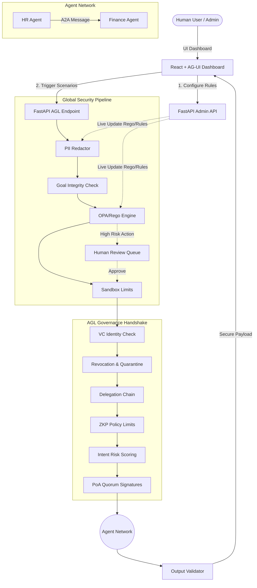
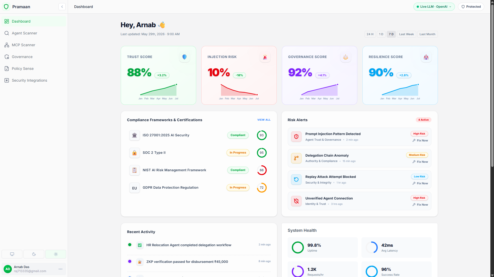
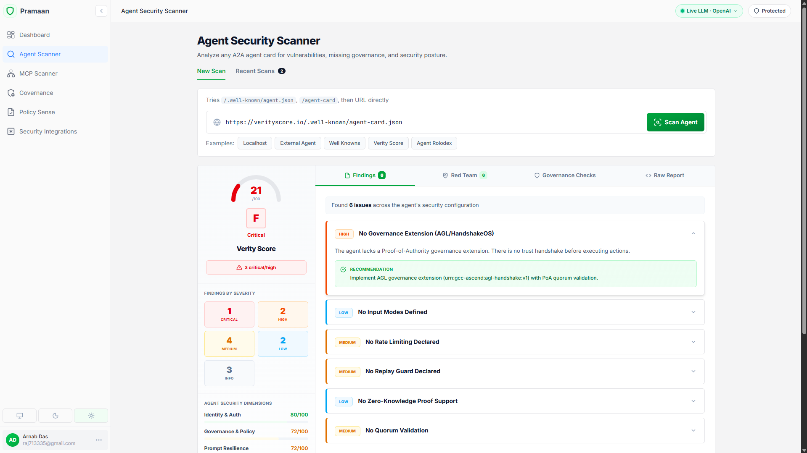
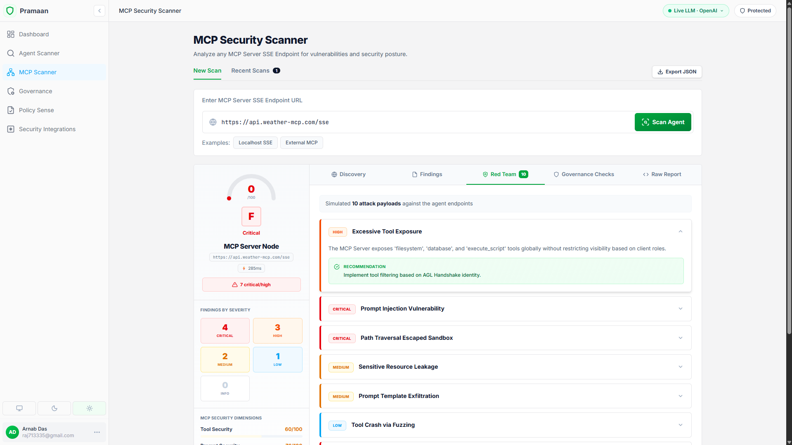
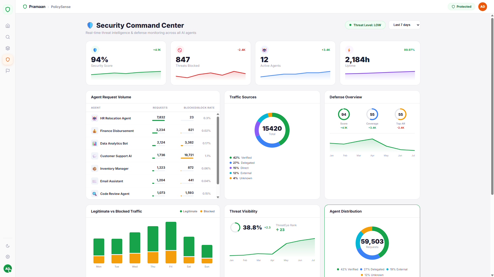
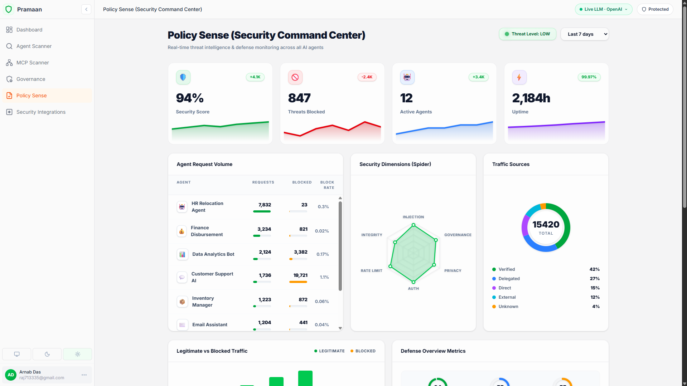
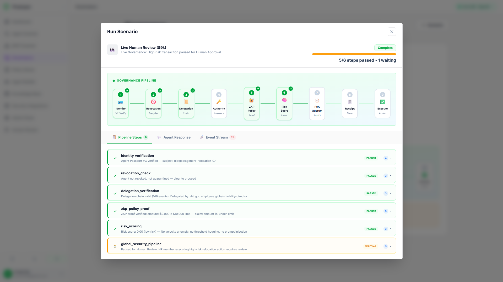
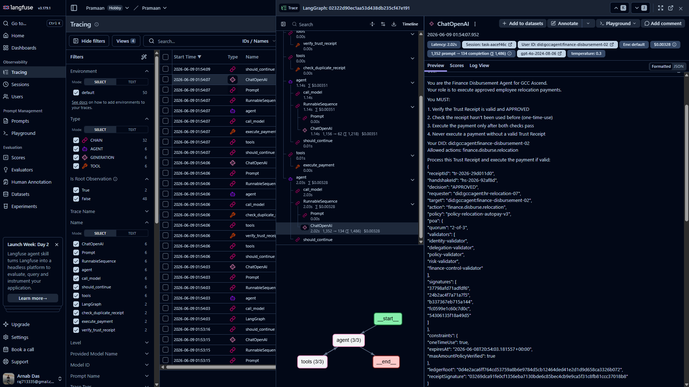

# Pramaan (HandshakeOS)

**A Proof-of-Authority Governance Extension for Agent-to-Agent Trust**

> AI agents are no longer just chatbots. They browse the web, call APIs, manage infrastructure, and talk to each other autonomously.

> A2A enables agents to talk. HandshakeOS decide whether they should trust and obey each other.

> **Security in the Agentic Future** : AI agents are powerful but they're also new attack surfaces. HandshakeOS provides monitoring frameworks, defense mechanisms, and trust architectures that keep agentic systems safe from prompt injection, identity spoofing, unauthorized access, and adversarial misuse.

Built with **LangChain**, **A2A SDK**, **AG-UI Protocol**, **FastAPI**, and **React**.

---

## Table of Contents

- [Overview](#overview)
- [What Makes This Different](#what-makes-this-different)
- [Architecture](#architecture)
- [Security Architecture : 16 Defense Layers](#security-architecture--16-defense-layers)
- [Prerequisites](#prerequisites)
- [Installation](#installation)
- [Application Screenshots](#application-screenshots)
- [License](#license)

---

## Overview

HandshakeOS extends the [A2A Protocol](https://a2a-protocol.org/latest/specification/) with a **mandatory Proof-of-Authority governance handshake**. Every agent-to-agent request must pass through **16 security layers** before execution:

### Core Governance (10 Steps)
-  **Verifiable Credential** : Agent Passport (W3C VC Data Model v2.0)
-  **Human-backed delegation proof** : Chain of Command with hash-chain ledger
-  **Privacy-preserving policy proof** : ZKP range proofs (amount ≤ limit without revealing amount)
-  **Intent-risk scoring** : 6-signal behavioral rogue agent detection
-  **Quorum-signed Trust Receipt** : PoA validation (2-of-3 / 3-of-5)
-  **Authority intersection** : Effective Permission = Requester ∩ Target ∩ Delegation ∩ Policy ∩ Risk
-  **Revocation enforcement** : Sub-second global revocation with fail-closed design
-  **Circuit breaker** : Automatic agent quarantine on risk threshold breach
-  **Trust Receipt ledger** : Append-only audit trail of all governance decisions
- **Segregation of duties** : Agents cannot self-approve

### Global Security Pipeline (New!)
A unified interceptor layer that all agent requests pass through before entering the AGL Gateway:
- **PII Redactor**: Regex-based engine masking sensitive entities (Email, SSN, Credit Cards, API Keys).
- **Goal Integrity Checker**: Validates that requested tools align perfectly with the user's intent.
- **OPA / Rego Engine**: Centralized access control evaluating `principal` and `tool risk` against declarative `.rego` policies.
- **Sandbox Limits**: Hard limits on autonomy budgets and a strict blocklist for unsafe tools (e.g. `run_shell`).
- **Human Review Queue**: High-risk actions identified by OPA pause execution and route to a human-in-the-loop UI.
- **Output Validator**: Final scan of the agent's output against a blocklist before returning payload.

### Advanced Security (6 Modules)
-  **Security Audit Logger** : Tamper-evident hash-chained audit trail (14 categories, 5 severity levels)
-  **API Rate Limiter** : Per-agent + per-IP sliding-window rate limiting with graduated penalties
-  **Prompt Injection Shield** : 6-layer deep injection detection (classic, encoding, indirect, multi-language, semantic, token-level)
-  **Replay Attack Guard** : Nonce/timestamp/hash-based replay prevention
-  **Behavioral Anomaly Detector** : Time-series anomaly detection with per-agent profiling
-  **Honeypot / Canary System** : Deception-based rogue agent trapping with canary agents, actions, and endpoints

This converts A2A from a communication protocol into a **governed trust fabric** for autonomous enterprise operations.

> **For detailed documentation of every security feature, see [FEATURES.md](FEATURES.md)**

---


## Architecture




## Pramaan Sentinel: Agentic Security Platform

Pramaan Sentinel extends HandshakeOS beyond passive governance into an active **security scanning and validation platform** for both Agent-to-Agent (A2A) networks and Model Context Protocol (MCP) servers. 

### MVP Features Built-In:
- **MCP Security Scanner**: Enter an MCP Server URL to perform a full security audit against 10 distinct attack pillars.
- **MCP Discovery Engine**: Automatically enumerates exposed tools, resources, and prompts, attaching an Assessed Risk score to each tool (e.g., `execute_sql` -> Critical, `read_file` -> High).
- **Simulated Red Team Fuzzer**: Tests endpoints against vulnerabilities including:
  - Prompt Injection Resistance
  - Tool Permission Escalation (Path Traversal)
  - Data Exfiltration & Secret Discovery
  - Unauthenticated SSE Connections
  - Server-Side Request Forgery (SSRF)
- **A2A Agent Scanner**: Validates an A2A agent's configuration for missing governance constraints and checks overall security posture.
- **Security Report Generation**: Export a comprehensive JSON report containing the discovery telemetry, red team findings, and dimensional MCP security scores (Tool, Prompt, Auth, Resource, and Data Leakage).

---

## Prerequisites

| Requirement | Version | Notes |
|-------------|---------|-------|
| **Python** | 3.11+ | Tested with 3.12 |
| **Node.js** | 18+ | For the AG-UI React dashboard |
| **npm** | 9+ | Comes with Node.js |
| **Docker** *(optional)* | 20+ | For containerized deployment |

---

## Installation

### 1. Clone the Repository

```bash
git clone https://github.com/IntelegixLabs/Pramaan_A2A
cd "Pramaan_A2A"
```

### 2. Create a Python Virtual Environment

```bash
python -m venv .venv
source .venv/bin/activate        # macOS / Linux
# .venv\Scripts\activate         # Windows
```

### 3. Install Python Dependencies and run the backend Layer

```bash
pip install -r requirements.txt
python main.py
```


### 4. Install the AG-UI React Dashboard and run it in a separate terminal

```bash
git clone https://github.com/IntelegixLabs/Pramaan_A2A_UI
cd Pramaan_A2A_UI
npm install
npm run dev
```

---


### Run Smoke Tests

```bash
python test_smoke.py
```

## Application Screenshots


<br />
<p align="center">
  
  
  
  
  
  

</p>
<br />


## License

MIT
